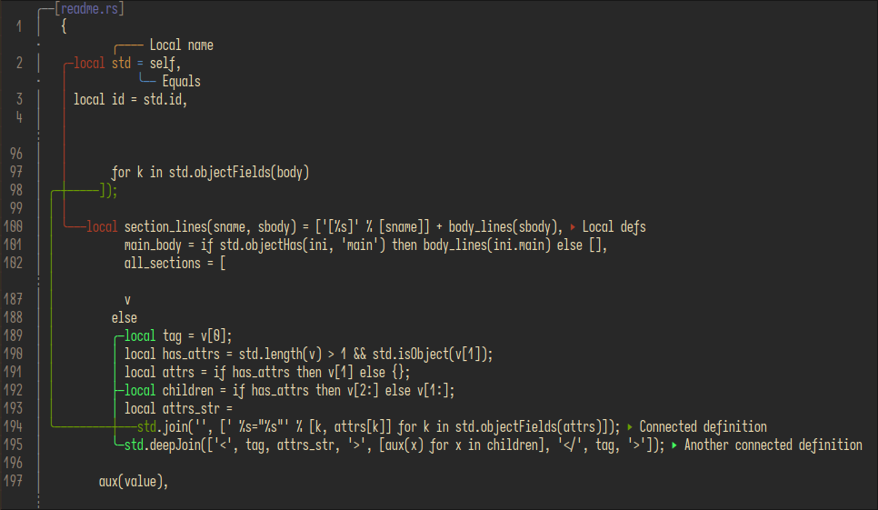
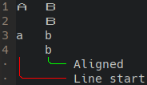
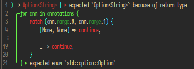

# hi-doc

Diagnostic formatting library.

## Motivation

Most diagnostic formatting libraries implement both formatting and span/source management simultaneously.
This can be beneficial for consistency, but it requires tying the code of your library to a third-party annotation
library, which can be inconvenient, especially when your library already has its own logic for diagnostics.

hi-doc solely implements diagnostic formatting, allowing for seamless integration with existing diagnostic logic
within a library.

## Finished features

- [x] Multiple ranges per annotation

- [x] Multi-line annotations

- [x] Multi-line annotation text

- [x] Support for unicode fullwidth characters

  

- [x] Correct handling of non-printable control characters, and configurable tab width

  

- [x] Formatting of the annotation text itself

- [x] Syntax highlightning in annotated text

  

- [ ] Support for non-colored terminals

- [x] Place annotations on top of the line
