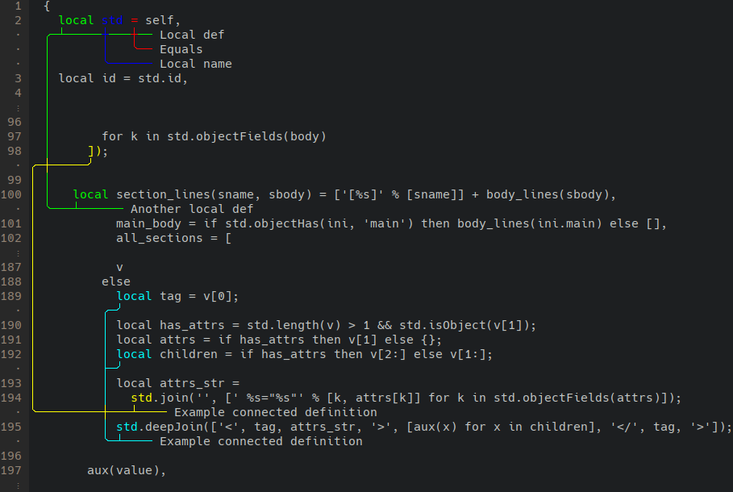

# ass-stroke

Diagnostics library

## Finished features

- [x] Multiple ranges per annotation

- [x] Multi-line annotations

- [x] Multi-line annotation text

- [x] Correct handling of non-printable control characters, and configurable tab width

- [x] Support for unicode fullwidth characters

  

- [x] Formatting of the annotation text itself

- [ ] Syntax highlightning in annotated text

- [ ] Support for non-colored terminals

- [ ] Place annotations on top of the line
